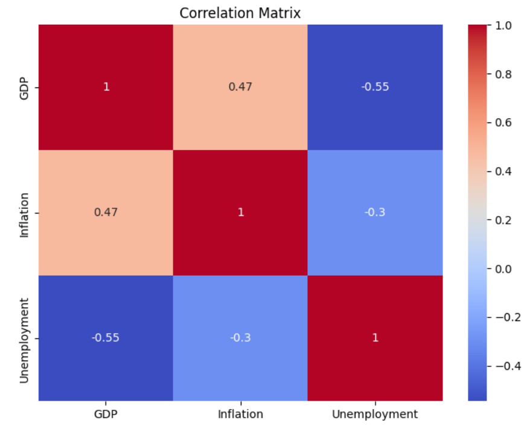

# European Macroeconomic Dashboard
> **My first Github project!** 


Analysing macroeconomic data with Eurostat datasets (between 2015 and 2022) to uncover trends and statistical insights relevant in modern Europe's banking and financial markets decision-making. I've analysed a few key macroeconomic factors - **GDP growth**, **inflation**, and **unemployment** — across Euro area countries. By leveraging datasets, Python, and its powerful libraries, I was able to apply myself to real-world economic data that impacts financial institutions.

## Key Features

- ✅ Aggregated and harmonised Eurostat datasets  
- ✅ Descriptive statistics of GDP, inflation, unemployment  
- ✅ Correlation matrix analysis of macroeconomic indicators  
- ✅ Clear visualisations

## Example Output

**Correlation Matrix Heatmap**  
*(This heatmap shows how GDP growth, inflation, and unemployment are interrelated, essential for market risk forecasting)*



## Tools I used for this project

| Tool         | Usage                                |
|--------------|--------------------------------------|
| Python       | Data analysis & visualization       |
| Pandas       | Data cleaning & manipulation        |
| Matplotlib   | Data visualization                  |
| Seaborn      | Statistical plots (correlation map) |
| Jupyter Lab  | Interactive coding environment      |
| Eurostat API | Data source                          |

## To run this,

1. Clone the repository
2. Open `dashboard_notebook.ipynb` in a Jupyter Notebook  
3. Download the below libraries!

```bash
pip install pandas matplotlib seaborn

